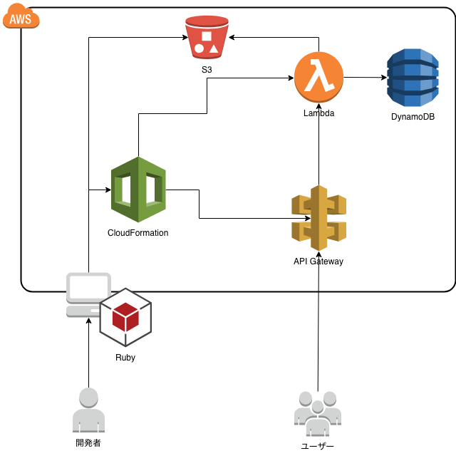

### Ruby on Serverless

Note:
---

### 自己紹介

- カキギカツユキ
- おっさんプログラマ
- 元SE
- 今は事業会社でシステム開発とかやってます
- メインの言語は Ruby と JavaScript

Note:
- 業務（システム・売掛金管理）3:開発 (コンサル・研究）7
---

#### 構成

- 自己紹介
- デモ
- サーバレスアプリケーション
- ふりかえり

Note:
- 今日話す内容
- 開発者向け
---

【やってみた】

AWS SAMでサーバレスアプリケーションを

デプロイしたらいい感じに。。。

Note:
---

### Mr M.COFFEEプロジェクト

Note:
- 実際にどのように使われるかを実演する
---

#### サイトページ

https://mr-mcoffee.hiroshima-arc.org/index.html

Note:
---

#### 管理ページ

https://mr-mcoffee.hiroshima-arc.org/admin/login

Note:
---

普通のサイトしてるだろ。

ウソみたいだろ。

サーバレスで動いているんだぜ。

それで。

Note:
---

あ、これはNode.jsで動いてますWww

Rubyちゃうやん・・・

Note:
---

Rubyで実装したサービスがこちらになります

[Mr.M Coffee](https://cpikfx3u12.execute-api.us-east-1.amazonaws.com/Prod/)

[Mr.M Coffee 管理画面](https://cpikfx3u12.execute-api.us-east-1.amazonaws.com/Prod/admin-login)

Note:
---

同じやないか〜

Note:
---

#### アーキテクチャ



Note:
---

#### サーバレスアプリケーション

[AWS サーバレスアプリケーションモデル](https://aws.amazon.com/jp/serverless/sam/)

Note:
---

#### サーバレスアプリケーションモデル(SAM)とは

- 設定は一箇所
- サーバレスアプリケーションがローカルでテスト・デバッグできる
- 開発ツールとの統合

Note:
---

#### サーバレスアプリケーションの開発 

[](https://gitpod.io/#https://github.com/k2works/mr-coffee-ruby.git)

```bash
pip install --user awscli
pip install --user aws-sam-cli
sam init --runtime ruby2.5
cd sam-app
sam build
```

Note:
---

#### サーバレスアプリケーションのリリース

クレデンシャルが必要になります

```bash
aws configure
AWS Access Key ID [None]: ****************
AWS Secret Access Key [None]: ****************
Default region name [None]: us-east-1
```

```bash
aws s3 mb s3://mr-mcoffee-ruby

sam package \
    --output-template-file packaged.yaml \
    --s3-bucket mr-mcoffee-ruby
    
sam deploy \
    --template-file packaged.yaml \
    --stack-name sam-app \
    --capabilities CAPABILITY_IAM
    
aws cloudformation describe-stacks \
     --stack-name sam-app \
     --query 'Stacks[].Outputs[?OutputKey==`HelloWorldApi`]' \
     --output table
```

Note:
---

#### サーバレスアプリケーションの廃棄

```bash
aws cloudformation delete-stack --stack-name sam-app
```

Note:
---

### ふりかえり

---

#### Keep

- サーバレスアプリケーションの開発がわずか数分で開始できる

Note:
---

#### Problem

- サーバレスアプリケーションの制約

Note:
- ファイル容量250MB
- アセット読み込み
- インチキログイン画面
- 今回の主題とは関係ないけどDynamoDB
---

#### Try

- [AWS Amplify](https://aws.amazon.com/jp/amplify/)でサーバレスWebアプリのリファクタリング

Note:
- 認証の実装
- EC2インスタンス、ElasticBeanstalkによる運用
- APIとWebインターフェースの分離
---

### おわり
